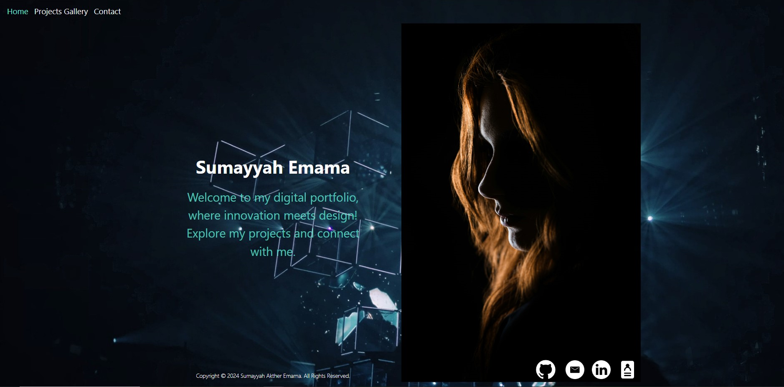
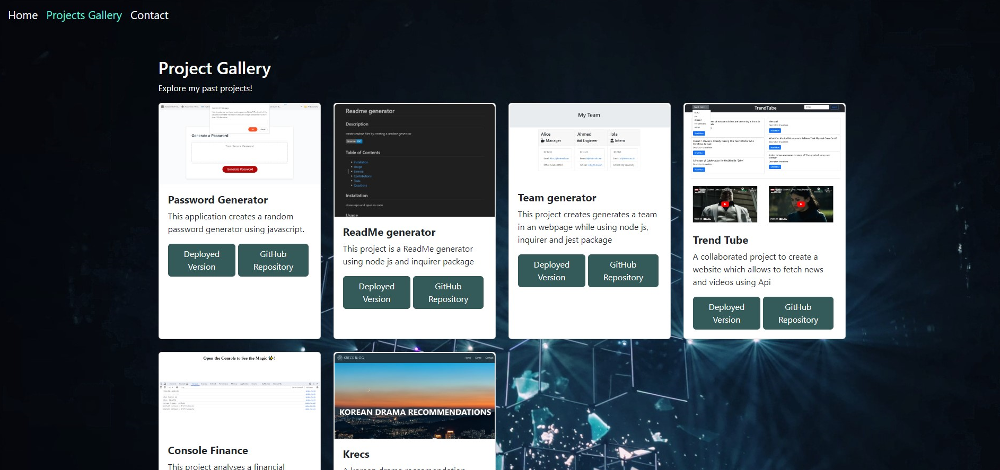
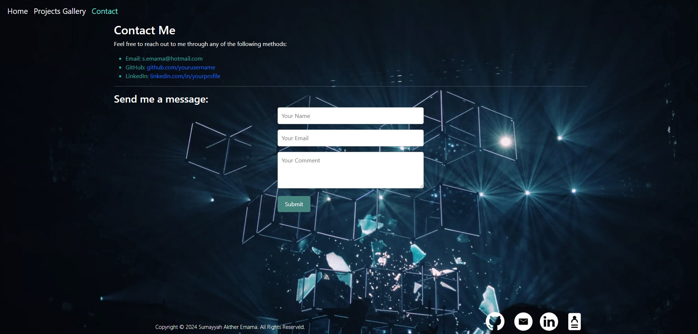

# React-portfolio

## Description

A sleek portfolio has been crafted using React, Bootstrap, and React Router. This dynamic blend ensures seamless navigation and responsive design across devices. It showcases my projects, skills, and achievements.

## Table of Contents

* [Installation](#installation)
* [Usage](#usage)
* [Credits](#credits)
* [License](#license)

## Installation

1) git clone git@github.com:username/repo.git
2) Change into project's directory
3) Start application on VS code
4) Install dependicies react-vite, bootstrap, react-router,node-js

## Usage 

1) Open terminal and type npm run dev
2) Open to browser
   

## Credits

Copyright © 2023 Sumayyah Akther Emama. All Rights Reserved.

Note: contributions from stack overflow and MDN.

## License

Licensed under the MIT license

## Deployment 

https://spontaneous-seahorse-c259b4.netlify.app
